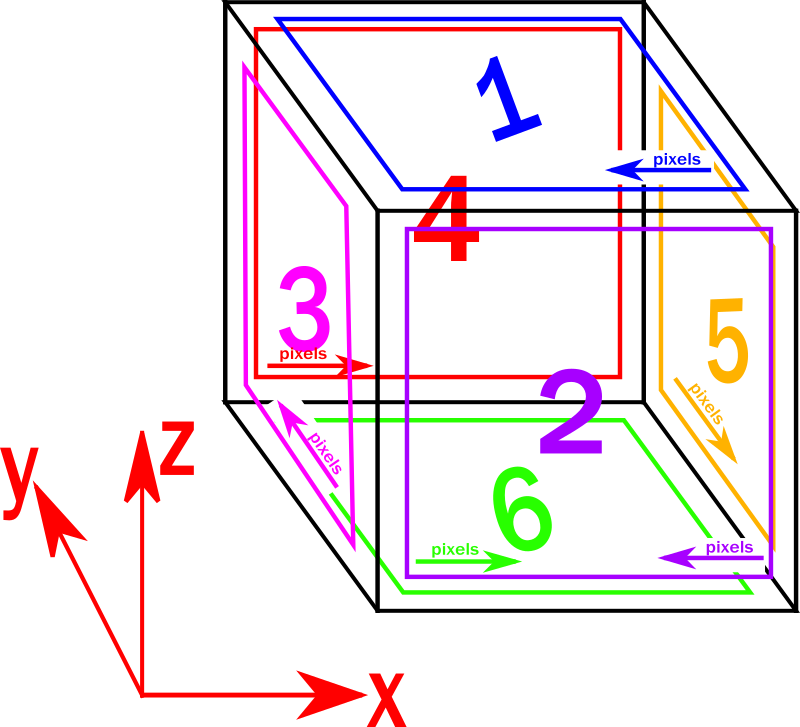

Please note that the map file here, written for the [Pixelblaze controller] (https://electromage.com/pixelblaze) 
reflects the following layout for the six (zigzag) WS2812 matrices in the base cube. The arrow on each side indicates the direction of the
first row on that matrix.

