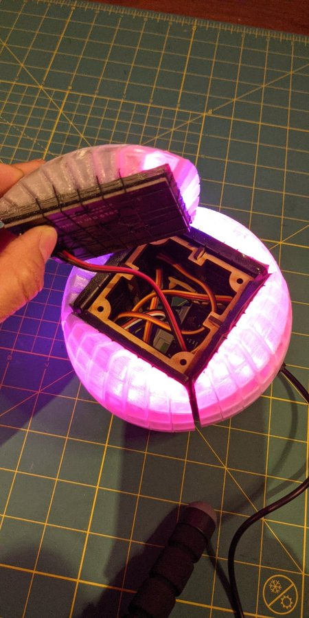

# CubeSphere
Design files and code for a 3D printed shell to transform an LED cube to a sphere. This is a work in progress and the documentation and design are not complete yet. Use at your own peril.

[Follow this link for video of the sphere](https://youtube.com/shorts/eQoiFBxLnEA?feature=share)

The sphere consists of 6 identical 3D printed pieces placed over the sides of an LED cube made from these specific 8x8 LED matrices: [https://shop.electromage.com/collections/addressable-leds](https://shop.electromage.com/collections/addressable-leds). This is important because the spacing won't match other LED strips or matrices. You can follow the steps in the Fusion 360 file to recreate the design if your LEDs have different spacing.

Currently the assembly is held together with string wrapped around the parts of the shell to hold them against the matrices.

