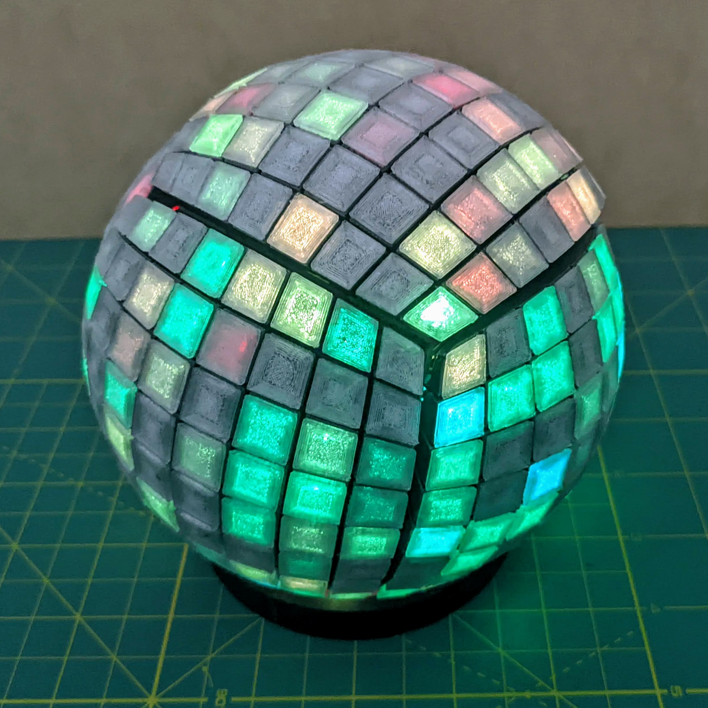

# CubeSphere
Design files and code for a 3D printed shell to transform an LED cube to a sphere. This is a work in progress and the documentation and design are not complete yet. Use at your own peril.

[Follow this link for video of the sphere](https://youtube.com/shorts/eQoiFBxLnEA?feature=share)

Currently the assembly is held together with string wrapped around the parts of the shell to hold them against the matrices.

